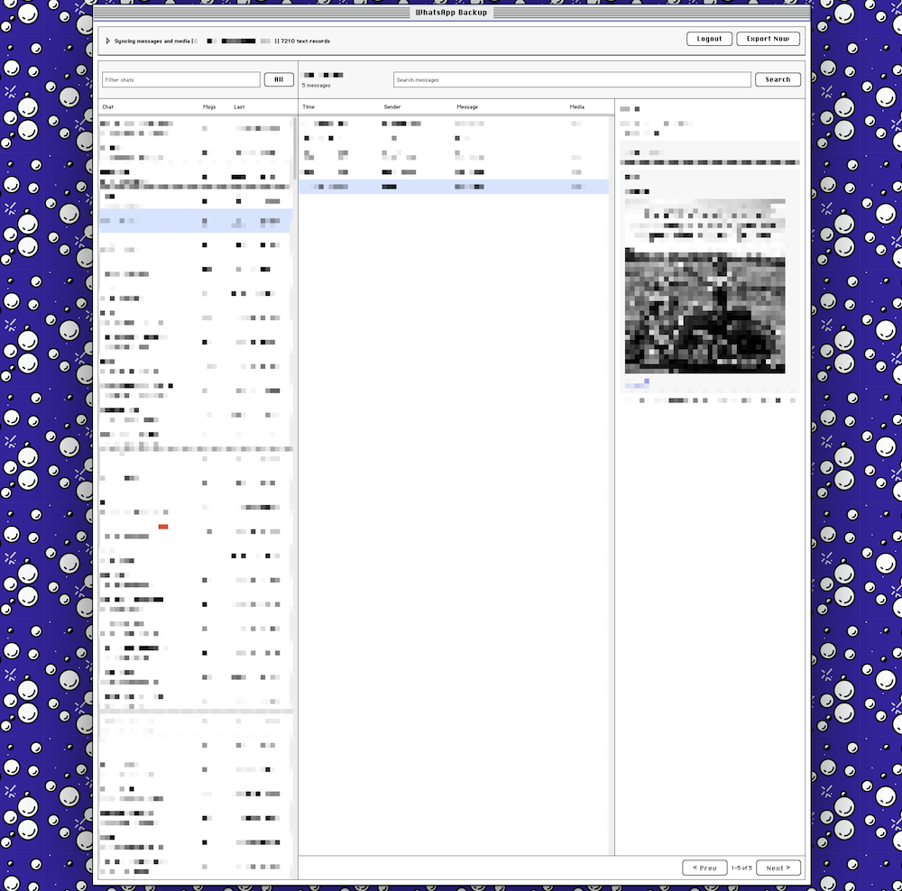

# WhatsApp Backup

Dockerized WhatsApp backup service built around [`steipete/wacli`](https://github.com/steipete/wacli). It exposes a local web UI for QR login, sync status, browsing, and searching backed-up messages.

> [!CAUTION]
> Do not expose this service directly to the Internet. It does not implement any authentication or security measures, and the WhatsApp session it manages has access to all your messages and media. Use it only on a trusted local network or behind a secure VPN.



## What It Does

- Runs in Docker with persistent storage for the visible text archive and private `wacli` state.
- Shows the WhatsApp QR login flow in the web UI.
- Keeps `wacli sync --follow --download-media` supervised after login.
- Uses conservative reconnect behavior: `wacli` handles reconnects internally, and the wrapper backs off before starting a new sync process after failures.
- Can send a one-shot SMTP email when a previously working WhatsApp connection fails.
- Exports synced messages into plain-text `.txt` files under `DATA_PATH/archive/messages` using atomic writes.
- Uses `wacli`'s local SQLite store only as an ingestion cache; already exported text files remain readable independently.
- Allows browsing chats, searching messages, and opening downloaded image/media files from the web UI.

## Quick Start

1. Copy the environment defaults:

```bash
cp .env.example .env
```

2. Build and run:

```bash
docker compose up -d --build
```

Update:

```bash
docker compose down
docker compose build --no-cache
docker compose up -d
```

3. Open the UI:

```text
http://<your-host-ip>:64009
```

4. Click **Start Login** and scan the QR code with WhatsApp under **Linked Devices**.

## Data Layout

The Compose file bind-mounts `DATA_PATH` to `/host-data` and writes plain-text records under `/host-data/archive`. Mounting the base directory keeps first startup reliable on fresh installs because the app can create the archive subdirectory itself. The `wacli` session store uses a Docker named volume because `wacli` requires Unix `chmod` support, which some host bind mounts do not provide.

- `/data/wacli`: `wacli` session, local message cache, and downloaded media in the `wacli-store` Docker volume.
- `/data/wacli/media`: downloaded media files managed by `wacli`.
- `/host-data/archive/messages`: plain-text backup records, one file per message, visible on the host as `DATA_PATH/archive/messages`.
- `/data/state`: app notification state in the `app-state` Docker volume.

Each message file contains headers for chat, sender, timestamp, media metadata, and the text body.

## Configuration

Key `.env` values:

- `WEB_PORT`: host port for the UI/API. Default: `64009`.
- `DATA_PATH`: host base directory for plain-text archive output. Default: `./data`; records are written under `./data/archive/messages`.
- `AUTO_SYNC`: keep sync running automatically after auth. Default: `1`.
- `EXPORT_INTERVAL_SECONDS`: interval for exporting `wacli` messages to text files. Default: `60`.
- `SYNC_MAX_RECONNECT`: how long one `wacli sync --follow` process may try reconnecting before exiting. Default: `30m`.
- `SYNC_RESTART_MIN_SECONDS`: minimum wait before restarting `wacli sync` after an unexpected exit. Default: `300`.
- `SYNC_RESTART_MAX_SECONDS`: maximum exponential backoff wait before restarting `wacli sync`. Default: `3600`.
- `SYNC_STABLE_SECONDS`: running sync duration required before the app treats the connection as restored and resets alert/backoff state. Default: `300`.
- `WACLI_REPO` / `WACLI_REF`: source used to build `wacli` into the image.

## SMTP Alerts

Set these values in `.env` to receive an email when a previously restored WhatsApp connection fails:

- `SMTP_HOST`: SMTP server hostname.
- `SMTP_PORT`: SMTP server port. Default: `587`.
- `SMTP_USERNAME`: SMTP username, if required.
- `SMTP_PASSWORD`: SMTP password, if required.
- `SMTP_FROM`: sender address.
- `SMTP_TO`: recipient address.
- `SMTP_USE_TLS`: use STARTTLS. Default: `1`.
- `SMTP_USE_SSL`: use implicit TLS/SMTPS. Default: `0`.
- `SMTP_SUBJECT_PREFIX`: email subject prefix. Default: `[WhatsApp Backup]`.

Alerts are deliberately one-shot per outage. After the app sends or attempts an outage email, it will not send another email until the connection has been restored for `SYNC_STABLE_SECONDS` and then fails again.

## WhatsApp Safety

The wrapper avoids tight reconnect loops:

- It runs a single `wacli sync --follow --download-media` process at a time.
- It lets that process handle reconnects internally with `--max-reconnect` instead of spawning repeated new sessions.
- If `wacli sync` exits unexpectedly, the wrapper waits at least `SYNC_RESTART_MIN_SECONDS` before starting it again, then exponentially backs off up to `SYNC_RESTART_MAX_SECONDS`.
- Manual QR login only runs when you click **Start Login** in the UI.

## Local UI Development

The UI uses the published `@lkmc/system7-ui` npm package.

```bash
npm install --prefix ui
npm --prefix ui run dev
```

Run the Flask backend separately if you want live API data:

```bash
DATA_DIR=./data WACLI_STORE_DIR=./data/wacli ARCHIVE_DIR=./data/archive WACLI_BIN=/path/to/wacli python app/app.py
```

## Notes

- WhatsApp Web history sync is best-effort. The primary phone may need to be online for older history to arrive.
- Downloaded media availability depends on WhatsApp media metadata and `wacli` being authenticated.
- The browser/search API reads the plain-text archive files, not `wacli.db`.
